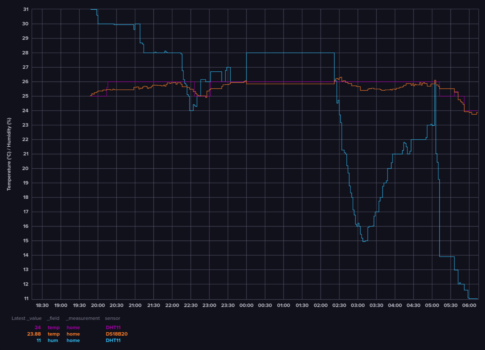

# ESP32 Room monitor

## Overview

A simple ESP32 room temperature and humidity monitor, which uses Wi-Fi to send the data to InfluxDB over HTTP.

## Sensors

- DS18B20 temperature sensor
- DHT11 temperature and humidity sensor

## Images

*InfluxDB dashboard*
