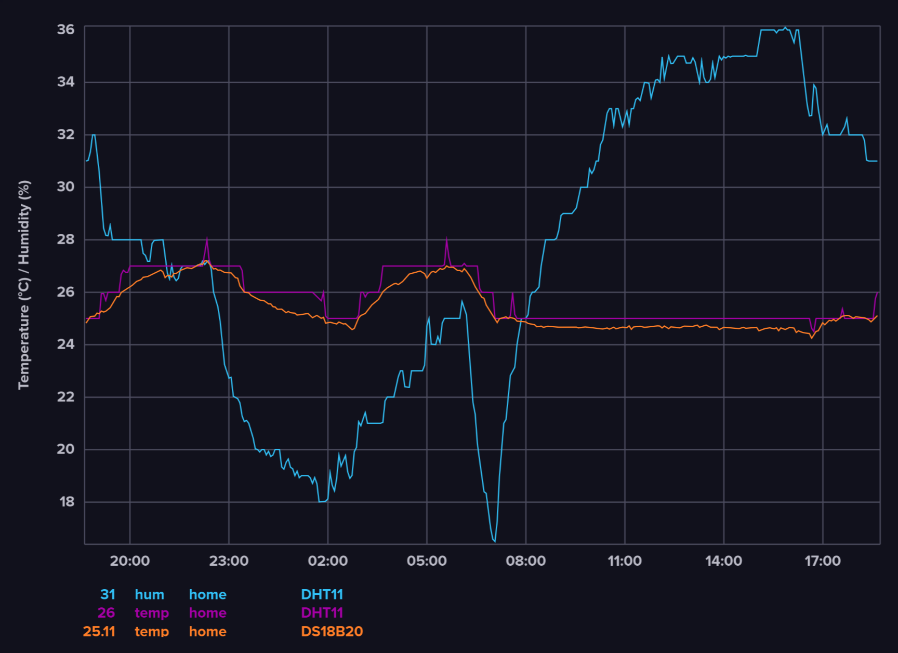

# ESP32 Room monitor

## Overview

A simple ESP32 room temperature and humidity monitor, which uses Wi-Fi to send the data to InfluxDB v2 over HTTP. Measurements are taken and stored at a one second interval. The buffered data is sent every minute. A watchdog restarts the device if it is stuck for more than 30 seconds.

## Hardware

- ESP32-DevKitC v4
- DS18B20 module (temperature)
- DHT11 module (temperature and humidity)

## Wiring

- DHT11 module connected to GPIO4, 5V and ground
- DS18B20 module connected to GPIO25, 5V and ground

## Crates

- embassy-net (Wi-Fi stack)
- reqwless (HTTP)
- embedded-dht-rs (DHT11)
- onewire (DS18B20)

## Requirements

- Works on Linux, Windows and OSX
- Requires an existing [InfluxDB v2 database](https://docs.influxdata.com/influxdb/v2/) for storing data

## Installation and usage

- Install Rust with [rustup](https://rustup.rs/)
- Install the [Rust toolchain for your ESP32 device](https://docs.espressif.com/projects/rust/book/getting-started/toolchain.html)
  - For ESP32-DevKitC v4, run:
  - ``cargo install espup --locked``
  - ``espup install``
  - On Linux and OSX, setup the [environment variables](https://github.com/esp-rs/espup?tab=readme-ov-file#environment-variables-setup):
    - ``. $HOME/export-esp.sh``
- Rename src/bin/secrets_example to secrets and add WiFi name, password, Influx token and hostname to mod.rs
- Run ``cargo run --release`` to flash and debug

## Issues

- Occasional sensor read errors when using Wi-Fi
- Repeating HTTP errors may cause device restart

## Images

*InfluxDB dashboard*

## License

